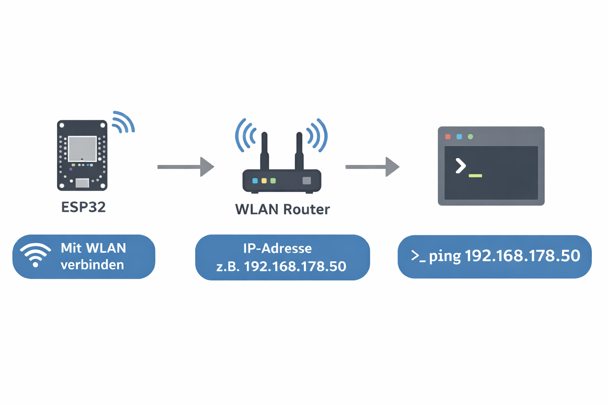
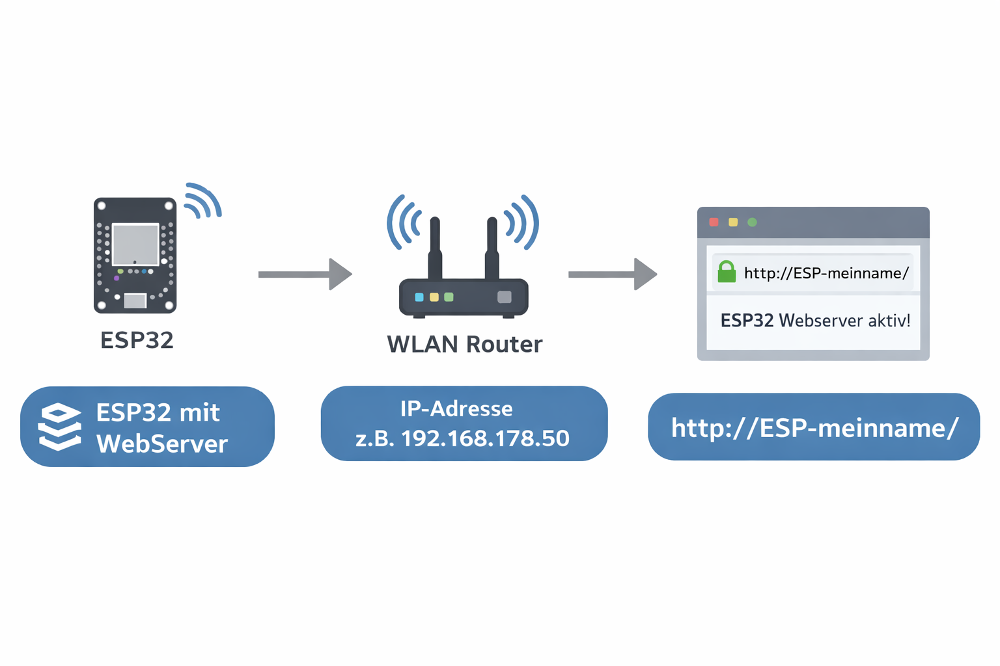
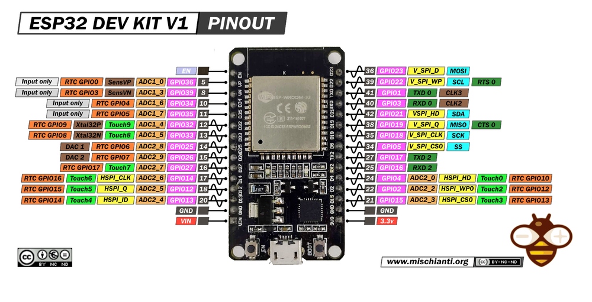

# 🌐 WLAN und Funk mit dem ESP32

## Inhaltsangabe

- [Was dich erwartet](#was-dich-erwartet)
- [Material](#material)
- [Der ESP32 als IoT Client](#iot-client)
- [1. Den ESP32 mit dem WLAN verbinden](#wlan-verbinden)
- [2. Der ESP32 stellt einen Webserver zur Verfügung](#webserver)
- [3. Temperatur und Luftfeuchtigkeit messen](#sensoren)
- [4. Der ESP32 steuert Aktuatoren](#aktuatoren)
- [5. RGB-LED mit dem Handy steuern](#rgb-led)
- [ESP32 Devkit](#esp32-devkit)
- [Erweitern der Arduino IDE für den ESP32](#arduino-ide-esp32)
- [Zusätzliche Informationen](#zusaetzliche-informationen)
- [Kontakt](#kontakt)
- [Mehr Projekte und Anleitungen](#mehr-projekte)


<a id="was-dich-erwartet"></a>
# Was dich erwartet

Du bist 14 Jahre alt oder älter und hast bereits Erfahrung in der Arduino-Welt? Du willst einen Microcontroller ins WLAN bringen und ihn über dein Handy steuern?   
Dann bist du hier richtig im Kurs **Internet of Things – ESP32 im WLAN**!  

In drei Stunden lernst du, wie du mit dem ESP32 Daten aus Sensoren ausliest. Du meldest deinen ESP32 im WLAN als WebServer an. Der ESP32 schickt die Messdaten ins WLAN.
Diese Messwerte kannst du direkt auf dem Browser deines Smartphones oder Laptops anschauen.  
Außerdem wirst du LEDs und LED-Streifen am ESP32 über dein Smartphone fernsteuern.

---

<a id="material"></a>
## 🧰 Material
- 1 × ESP32 DevKit
- 1 × Sensor (BME280 oder DHT22)
- Jumperkabel, Breadboard
- LEDs, Widerstände
- RGB LED
- WLAN-Zugangsdaten (SSID + Passwort)
- Laptop mit Ardiono IDE oder Visual Studio Code mit Extension PlatformIO. Eine Anleitung zur Installation findest du unten.
- Smartphone/Laptop mit Browser


<a id="iot-client"></a>
# Jetzt kann es losgehen: Der ESP32 als IoT Client - Schritt für Schritt
1. ESP32 ist mit dem WLAN verbinden
2. ESP32 stellt einen Webserver zur Verfügung
3. ESP32 misst Sensordaten und stellt sie über seinen Webserver bereit
4. ESP32 empfängt Befehle und steuert Aktuatoren

<a id="wlan-verbinden"></a>
## 📅 1. Den ESP32 mit dem WLAN verbinden


<table><tr><td width="600">

<br><em>Der ESP32 meldet sich im WLAN beime Router an. Ein Laptop im selben WLAN kann dann den ESP32 mit dem Befehl 'ping IP-Adresse' ansprechen</em>
</td></tr></table>


### 🎯 Challenge 01a Verbinde deinen ESP32 mit dem WLAN.  
[challenge_01a_esp32_mit_wlan_verbinden.cpp](challenge_01a_esp32_mit_wlan_verbinden.cpp)   


💻 Zum Testen: Öffne die Commandline (Windows), das Terminal (macOS) oder die Shell (Linux) und gebe ein:
```bash
ping 192.166.187.25
```

---

Bisher kannst du den ESP32 nur über die umständliche IP Adresse ansprechen. Mach die Eingabe  komfortabler, indem du deinem ESP32 einen gut lesbaren Netzwerknamen zuweist.  

### 🎯 Challenge 01b: Gib deinem ESP32 im WLAN einen Namen.   
[challenge_01b_esp32_mit_mdns_namen_anmelden.cpp](challenge_01b_esp32_.mit_mdns_namen_anmelden.cpp)  


💻 Zum Testen: Öffne die Commandline und gebe ein:
```bash
ping ESP-name.local
```

**Hinweis:** Je nach Router ist der Zusatz `.local` erforderlich oder nicht.

---

<a id="webserver"></a>
## 📅 2. Der ESP32 stellt einen Webserver zur Vefügung

Bis jetzt kan der ESP32 nur per Commandline und `ping` Befehl angesprochen werden.   
Jetzt wollen wir den ESP32 über eine Browser wie  `Firefox` oder `Chrome` über seine URL ansprechen. Beispiel `http://esp-meinname/`

<table><tr><td width="600">

<br><em>Der ESP32 als WebServer. Der Browser auf dem PC fragt den ESP32 mit 'http://ESP-meinname/ an. Der Webserver auf dem ESP32 Antwortet mit `ESP32 Webserver aktiv` </em>
</td></tr></table>


### 🎯 Challenge 03: Richte eine WebServer auf dem ESP32 ein.   
Der ESP32 ist bereits im WLAN angemeldet. Jetzt starten wir zusätzlich einen Webserver auf dem ESP32   
[challenge_02_webserver_einrichten.cpp](challenge_02_webserver_einrichten.cpp)


🌐 Test: Öffne den Browser und gib die URL ein. Mit deinem ESP Namen.
```http
http://ESP-meinname/
```
--- 

<a id="sensoren"></a>
## 📅 3. Temperatur und Luftfeuchtigkeit messen und im Browser anzeigen

<table><tr><td width="600">

<br><em>Der ESP32 liest Werte aus einem Sensor und stellt sie als Webserver zur Verfügung. Die Messwerte können auf einem Browser dargestellt werden</em>
</td></tr></table>

Wir schliessen einen Sensor am ESP32 an. Der Sensor misst Temperatur und Luftfeuchtigkeit. Der ESP liest den Sensor aus und stellt die Messwerte in seinem WebServer zur Verfügung.


So wird der Sensor DHT11 angeschlossen:   
`+` und `-` am Sensor geht auf den ESP32 auf `5V` und `GND`  
`OUT` am Sensor geht auf den ESP32 `GPIO4` 


- [ESP32 und DHT11 Steckbrett](zusatzmaterial/ESP32_DHT11_bb.png)
- [ESP32 und DHT11 Schaltplan](zusatzmaterial/ESP32_DHT11_schem.png)
- [DHT11 Pinout](zusatzmaterial/dht11_pinout.jpg)


Um die Messdaten abrufbar zu machen, programmieren wir zwei neue Endpoints für Temperatur und Luftfeuchtichkeitsmessung (Humidity)
```http
http://ESP-meinname/temp
http://ESP-meinname/hum  
```

  
Wird einer dieser beiden Endpoints vom Browser angefragt, liest der ESP32 zunächst den dazugehörigen Sensor-Messwert aus und schickt dann den Messwert an den Browser zurück.


### 🎯 challenge 03: DHT Sensordaten mit dem Webserver anzeigen

[Challenge_03_dht_sensordaten_im_webserver_anzeigen.cpp](challenge_03_dht_sensordaten_im_webserver_anzeigen.cpp)

---


<a id="aktuatoren"></a>
## 4. Der ESP32 empfängt Befehle vom Client und steuert Aktuatoren
Es geht auch in die andere Richtung:  
Der ESP kann nicht nur Daten vom Sensor lesen, sondern auch Ausgänge schalten.  

Der ESP32 schaltet eine LED.   
So wird die LED angeschlossen:   
Wir verwenden den ESP32 Ausgang `GPIO12`.     
Über einen 220Ohm Widerstand gehen wir auf den `+` Eingang der LED (langer Anschluss Draht).   
Der kurze LED Anschluss geht auf den ESP32 `GND`

- [ESP und LED Steckbrett](zusatzmaterial/ESP32_LED_bb.png)
- [ESP und LED Schaltplan](zusatzmaterial/ESP32_LED_schem.png)

Der Browser schickt ein Kommando an den ESP32 und der ESP32 schaltet dann einen Aktuator, zum Beispiel unsere Leuchtdiode.  
Dazu programmieren wir zwei neue Endpoints: 

```http
http://ESP-meinname/led_ein
http://ESP-meinname/led_aus 
```
### 🎯 challenge 04: LED am ESP23 mit dem Browser schalten
[challenge_04_led_on_off.cpp](challenge_04_led_on_off.cpp)

---


<a id="rgb-led"></a>
## 5. Jetzt wird's bunt: RGB-LED mit dem Handy steuern


In dieser Challenge steuerst du eine RGB-LED.
Wie du die RGB LED an den ESP32 anschließt, findest du hier:
- [ESP32 und RGB-LED Steckbrett](zusatzmaterial/ESP32_RGB_bb.png)
- [ESP32 und RGB-LED Schaltplan](zusatzmaterial/ESP32_RGB_schem.png)

Du steuerst die RGB LED über den Webbrowser:
- Im Browser kannst du die Werte für Rot, Grün und Blau einstellen mit drei Schiebereglern oder Eingabefeldern.
- Der ESP32 empfängt die Werte und steuert damit die drei Farben der RGB-LED.


Du programmierst einen neuen Endpoint `/set_rgb`, der drei Parameter für die Farben erhält:

- http://<mein_server>/set_rgb?r=255&g=0&b=128

[challenge_05_rgb_led.cpp](challenge_05_rgb_led.cpp)


<a id="esp32-devkit"></a>
### ESP32 Devkit
Es gibt das ESP32 Devkit in 2 Layout Versionen:

<table><tr><td width="600">

<br><em>ESP32 DevKit v1 Pinout (2*15 Pin)</em>
</td></tr></table>

<table><tr><td width="600">

<br><em>ESP32 DevKitC v3 und v4 Pinlayout (2×19 Pin)</em>
</td></tr></table>

<a id="arduino-ide-esp32"></a>
### Erweitern der Arduino IDE für den ESP32
https://youtu.be/RbEGBOytZzc?si=KouAGV5stZRRLF-T

<a id="zusaetzliche-informationen"></a>
## ℹ️ Zusätzliche Informationen
Weitere Details und technische Informationen zum ESP32 DevKitC findest du in der offiziellen Dokumentation:  
[ESP32-DevKitC Dokumentation (Espressif)](https://docs.espressif.com/projects/esp-dev-kits/en/latest/esp32/esp32-devkitc/index.html#esp32-devkitc)
...existing code...

<a id="kontakt"></a>
## 📞 Kontakt

Bei Fragen zum Kurs oder Material:  
**MINT-Labs Regensburg**  
🌐 [https://www.mint-labs-regensburg.de/](https://www.mint-labs-regensburg.de/)


<a id="mehr-projekte"></a>
## Mehr Projekte und Anleitungen findest du [hier](https://wiki.mint-labs.de/)
