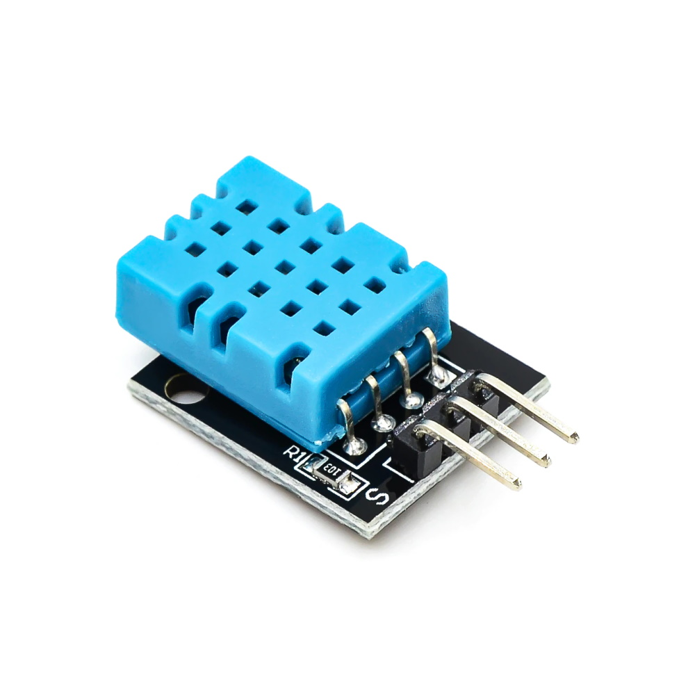
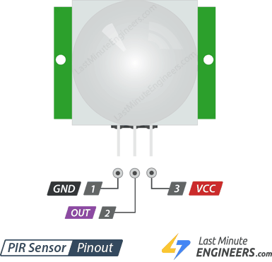
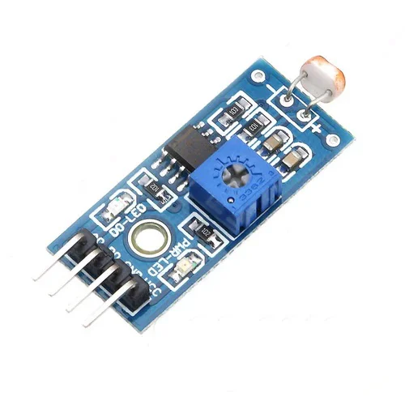
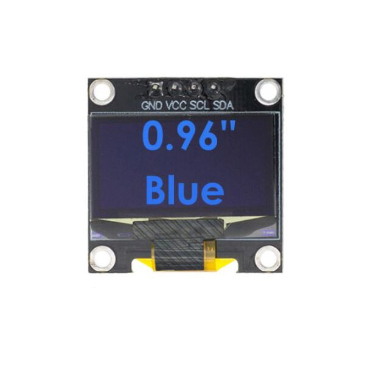
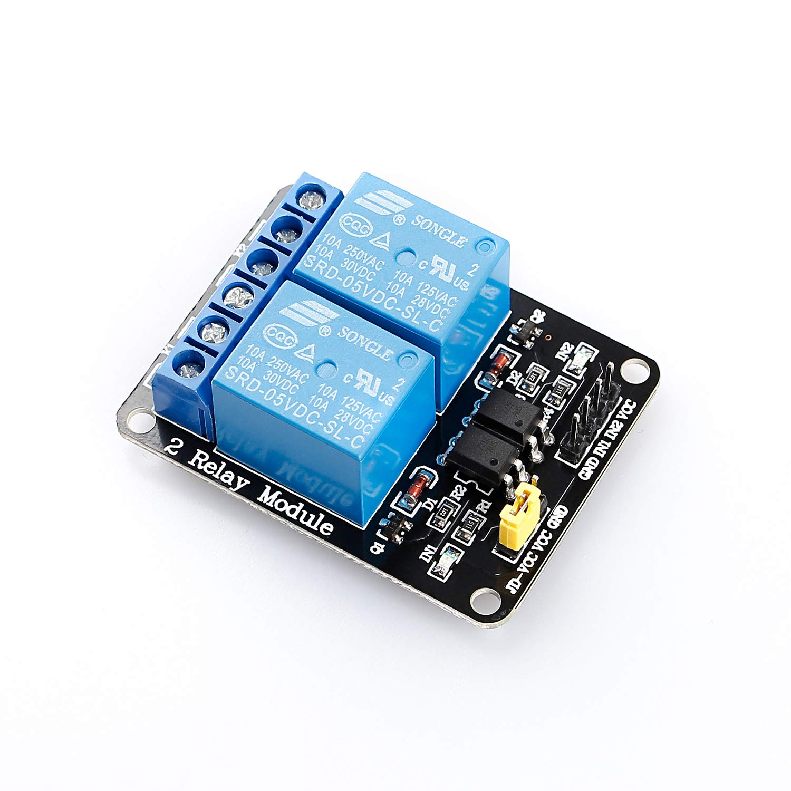

# Häüfig verwendete Sensoren und Aktuatoren

## DHT11 Temperatur- und Feuchtesensor

<table><tr><td width="300">

 <em>DHT11 Temperatur- und Feuchtesensor. Der Sensot wird über den </em>
</td></tr></table>

## Bewegungssensor HC-SR501

<table><tr><td width="300">

 <em>Bewegungssensor HC-SR501</em>
</td></tr></table>

Video: [Alarmanlage mit Bewegungsmelder HC-SR501](https://youtu.be/IOiTSSdJJ78?si=DRHg5MF2ynqNnXCE)

Anschluss am ESP32 DevKit:
- VCC -> 5V
- GND -> GND
- OUT -> GPIO27

Beispielcode: [loesungen_esp_kit/hc_sr_501.cpp](loesungen_esp_kit/hc_sr_501.cpp)

## Infrarot Abstands/Hindernis Sensor 

<table><tr><td width="300">

 <em>Infrarot Abstandssensor</em>
</td></tr></table>

## LDR Helligkeitssensor / Lichtsensor

<table><tr><td width="300">

 <em>Helligkeitssensor-Modul mit Fotowiderstand und Analogausgang A0. D0 Ausgang schaltet bei einer am Poti einstellbaren Helligkeit</em>
</td></tr></table>

Die OLED Anzeige wird mit den Libraries angesteuert: 
Adafruit SSD1306 und Adafruit GFX Library
OLED SDA GPIO 21
OLED SCL GPIO 22

## 12864 OLED Display 

<table><tr><td width="300">

 <em>12864 OLED Display</em>
</td></tr></table>

CME12864-11 (ein typisches 128x64 I2C OLED-Display) verwendet Datei > Beispiele > Adafruit SSD1306 > ssd1306_128x64_i2c

## Relay Modul

<table><tr><td width="300">

 <em>Relay Modul. Die beiden Relais könnenn grosse Verbraucher schalten.</em>
</td></tr></table>

